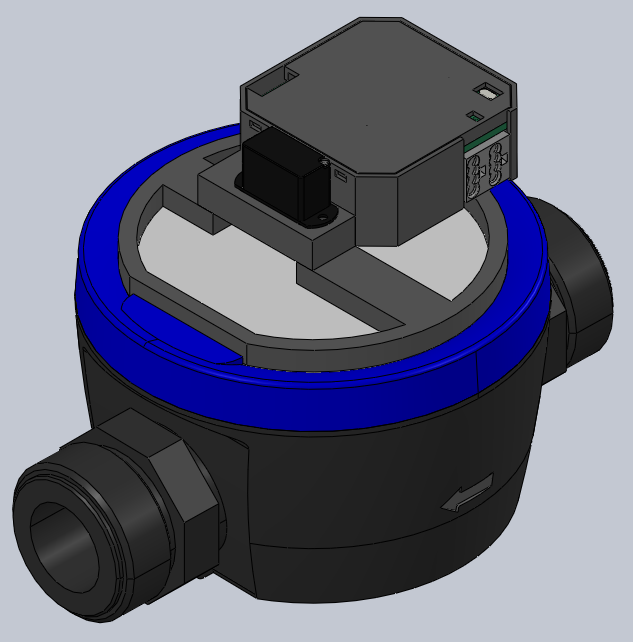

# KNX KMP Watermeter

KNX TP1 interface for Kamstrup water/heat meters via the KMP (Kamstrup Meter Protocol). Reads meter data (volume, flow, temperature, battery life) and exposes it on the KNX bus.

## Overview

The device is built around an RP2040 (Raspberry Pi Pico) coupled to the KNX bus via an NCN5130-based BCU. It polls the meter over its optical interface using the KMP protocol and publishes the readings as KNX group objects:

- **Volume** (m³)
- **Flow** (l/h)
- **Temperature** (°C)
- **Battery life** (days)

Registers can be enabled/disabled individually and polled on a configurable crontab-style schedule.

## Project Structure

| Directory | Description | Documentation |
|-----------|-------------|---------------|
| `firmware/` | RP2040 firmware (PlatformIO, C++) | [Readme.md](firmware/Readme.md) |
| `hardware/` | PCB design (Altium Designer) | [Readme.md](hardware/Readme.md) |
| `housing/` | 3D-printable enclosure (SOLIDWORKS) | [Readme.md](housing/Readme.md) |
| `software/` | KNX ETS product database source | [Readme.md](software/Readme.md) |

## Firmware

Custom firmware for the RP2040 that implements the KMP protocol stack over UART to communicate with Kamstrup Multical 601/801 meters. Data is published via the KNX TP1 bus using the thelsing/knx library with an NCN5130-based BCU. Meters are polled via a servo-actuated wake-up mechanism.

See [firmware/Readme.md](firmware/Readme.md) for build, flash, and test instructions.

## Hardware

Custom 2-layer PCB combining an RP2040 MCU with an NCN5130 BCU (NanoBCU-based) for KNX TP1 bus coupling. Includes a servo driver for meter wake-up and an IR optical transceiver for KMP communication.

See [hardware/Readme.md](hardware/Readme.md) for the project structure and production package.

## Housing

Flush-mount 3D-printable enclosure consisting of four printed parts, designed for standard installation boxes.

See [housing/Readme.md](housing/Readme.md) for the model files and ready-to-print STL exports.

## ETS Configuration

KNX product database for ETS (tested with ETS 6.6). The device exposes group objects for volume, flow, temperature, and battery life, with configurable polling intervals and per-register enable/disable.

See [software/Readme.md](software/Readme.md) for group objects, parameters, and regeneration instructions.

## License

MIT — see [LICENSE](LICENSE).
