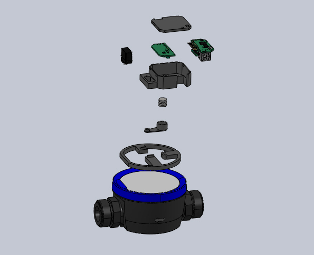

# Housing — KMP Watermeter Enclosure

3D-printable housing for the KMP Watermeter - designed to be robust and compact.

## Assembly

The animation below shows how the individual parts come together into the final assembly:

## Model

The housing is modeled in SOLIDWORKS and consists of four parts:

| Part | File |
|------|------|
| Housing | [Housing.SLDPRT](parts/Housing.SLDPRT) |
| Cover | [Cover.SLDPRT](parts/Cover.SLDPRT) |
| Servo Arm | [Servo Arm.SLDPRT](parts/Servo%20Arm.SLDPRT) |
| Fixture | [Fixture.SLDPRT](parts/Fixture.SLDPRT) |

The part files are available in the [parts](parts/) directory. The complete assembly combining all parts and PCBs is available in the [assembly](assembly/) directory.

## Exported STL Files for Printing

If you'd like to print the housing as-is, the ready-to-use STL files are available in the [print_package](print_package/) directory.
